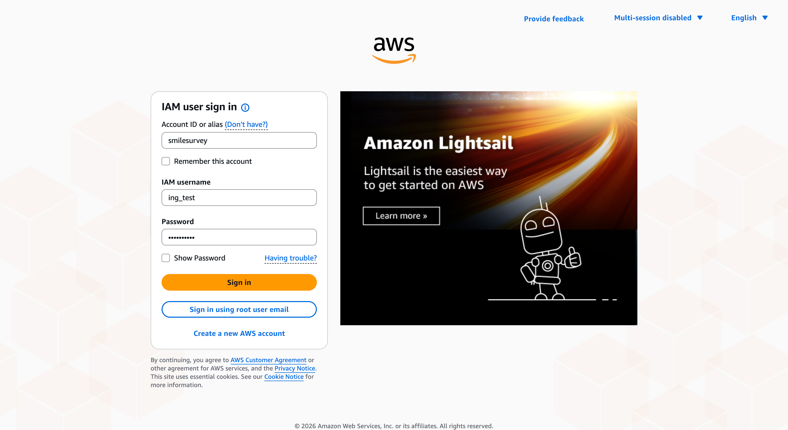
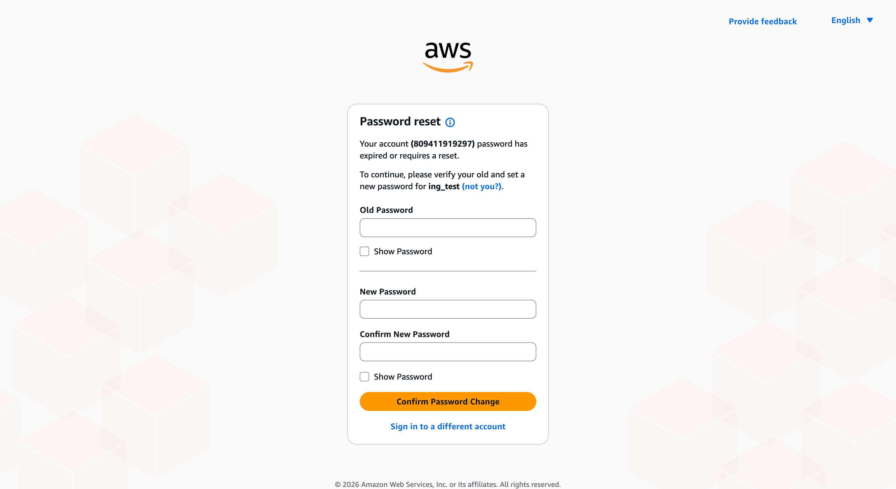
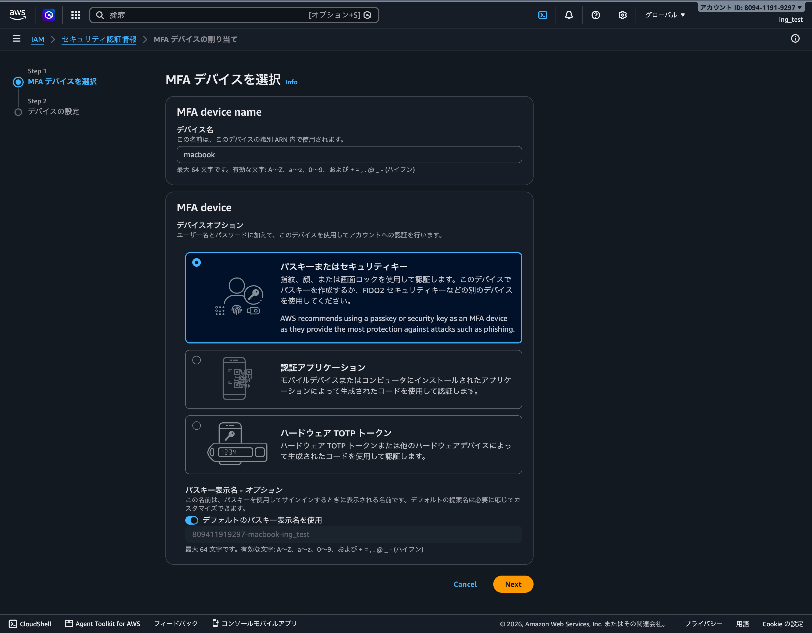
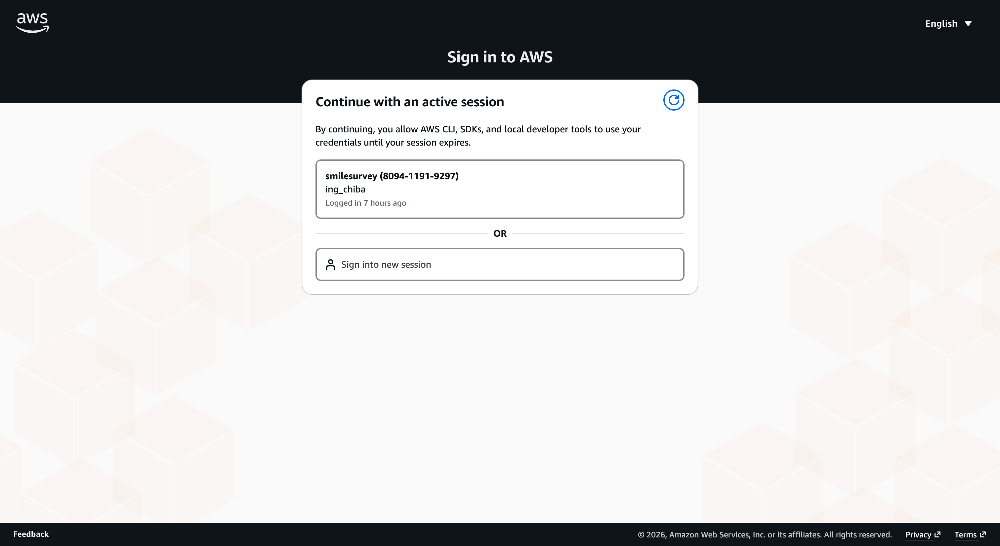

# Claude Code を AWS Bedrock (smilesurvey アカウント) で使うセットアップ手順

全体の流れは以下の通り。

0. IAM ユーザーの発行を千葉に依頼
1. AWS コンソールにログイン
2. 多要素認証 (MFA) の設定
3. AWS CLI の設定
4. Claude Code でログイン

## 0. IAM ユーザーの発行を千葉に依頼

千葉に依頼して IAM ユーザーを発行してもらい、ユーザー名と初期パスワードを受け取る。

<details>
<summary>IAM ユーザーの発行</summary>

1. IAM ユーザーを作成(命名は `ing_xxxx` 形式)
2. コンソール用の初期パスワードを発行(初回ログイン時に変更を強制)
3. グループ `bedrock-users-group`(Bedrock 呼び出し権限)と `ConsoleUsers`(コンソール・MFA 自己管理権限)に追加

初期パスワードはランダム生成する(次のコマンドでのクォート事故を避けるため `'` `"` `` ` `` `$` `\` は除外)。

```sh
aws secretsmanager get-random-password --password-length 10 --exclude-characters "'\"\`\$\\" --profile smilesurvey --query RandomPassword --output text
```

ユーザー作成・初期パスワード設定・グループ追加を実行する。

```sh
aws iam create-user --user-name ing_xxxx --profile smilesurvey
aws iam create-login-profile --user-name ing_xxxx --password '<生成した初期パスワード>' --password-reset-required --profile smilesurvey
aws iam add-user-to-group --group-name bedrock-users-group --user-name ing_xxxx --profile smilesurvey
aws iam add-user-to-group --group-name ConsoleUsers --user-name ing_xxxx --profile smilesurvey
```

作成したら、ユーザー名と初期パスワードを本人に安全な方法で渡す。

</details>

## 1. AWS コンソールにログイン

<https://smilesurvey.signin.aws.amazon.com/console> を開き、以下でサインインする。

| 項目 | 入力値 |
|------|--------|
| アカウント | `smilesurvey` |
| ユーザー名 | 千葉から渡された `ing_xxxx` |
| パスワード | 千葉から渡された初期パスワード |



初回ログイン時にパスワードの変更を求められるので、新しいパスワードを設定する。



## 2. 多要素認証 (MFA) の設定

このアカウントは MFA を設定するまでほぼすべての操作(Bedrock の呼び出しを含む)が拒否されるポリシーになっている。ログイン後に MFA 設定を促す画面は出ないので、ログインしたら最初に必ず自分で MFA を設定すること。

<https://us-east-1.console.aws.amazon.com/iam/home?region=us-east-1#/security_credentials/mfa> を開き、**MFA デバイスの割り当て** を選択する。

デバイス名(例: `macbook`)を入力し、デバイスオプションは **パスキーまたはセキュリティキー**(推奨)を選んで **次へ**。画面の指示に従い Touch ID などで登録を完了する。認証アプリ(Google Authenticator 等)を使いたい場合は **認証アプリケーション** を選んでもよい。



登録後、一度サインアウトして MFA 付きで再ログインしておく(以降のセッションに MFA が効いていることの確認になる)。

## 3. AWS CLI の設定

AWS CLI が入っているか確認する。

```sh
aws --version
```

コマンドが見つからない場合は、以下を開いてインストールする。

<details>
<summary>AWS CLI をインストールする</summary>

AWS CLI は Homebrew でインストールする。まず Homebrew が入っているか確認する。

```sh
brew --version
```

コマンドが見つからない場合は Homebrew を先にインストールする。

```sh
/bin/bash -c "$(curl -fsSL https://raw.githubusercontent.com/Homebrew/install/HEAD/install.sh)"
```

AWS CLI をインストールする。

```sh
brew install awscli
```

</details>

リージョンを設定してからログインする(プロファイルはこの2コマンドで `~/.aws/config` に自動で作られる)。

```sh
aws configure set region ap-northeast-1 --profile smilesurvey
aws login --profile smilesurvey
```

ブラウザが自動で開くので、指示に従ってサインイン・許可を進める。



「You can close this window」が出たらブラウザを閉じてターミナルに戻る。

疎通確認する。Arn に自分のユーザー名が出れば OK。

```sh
aws sts get-caller-identity --profile smilesurvey
```

```json
{
    "UserId": "AIDAXXXXXXXXXXXXXXXXX",
    "Account": "809411919297",
    "Arn": "arn:aws:iam::809411919297:user/ing_xxxx"
}
```

## 4. Claude Code でログイン

`claude` を起動し、`/login` を実行する。ログイン方法の選択が出るので **3rd-party platform** を選ぶ。

```shell
Claude Code can be used with your Claude subscription or billed based on API usage through your Console account.

Select login method:

  1. Claude account with subscription · Pro, Max, Team, or Enterprise
  2. Anthropic Console account · API usage billing
❯ 3. 3rd-party platform · Amazon Bedrock, Microsoft Foundry, or Vertex AI
```

プラットフォームの選択が出るので **Amazon Bedrock** を選ぶ。

```shell
Using 3rd-party platforms

❯ 1. Amazon Bedrock · interactive setup
  2. Claude Platform on AWS · refresh credentials
  3. Microsoft Foundry · opens docs
  4. Google Vertex AI · interactive setup
  5. Go back
```

認証方法を聞かれるので **AWS profile** を選ぶ。

```shell
Set up Amazon Bedrock
How do you authenticate to AWS?

Claude Code uses the standard AWS credential chain. Pick the method you already use with the AWS CLI.

❯ 1. AWS profile (SSO or named profile)
  2. Bedrock API key (bearer token)
  3. Access key + secret
  4. Use credentials already in my environment
```

`~/.aws` から検出されたプロファイル一覧が出るので `smilesurvey` を選ぶ。

```shell
AWS profile

Found 2 profiles in ~/.aws/config and ~/.aws/credentials.

❯ 1. smilesurvey
  2. (その他のプロファイル)
```

リージョンの入力を求められる。デフォルトは米国リージョンになっているので、`ap-northeast-1` に変更して Enter する。

```shell
AWS region

Where your Bedrock models are enabled.
Claude Code reads this from AWS_REGION, not ~/.aws/config — set it explicitly even if your profile has a region.

ap-northeast-1
```

認証とモデルの検証結果が表示されるので、**Continue** を選ぶ。`Authenticated as` に自分のユーザー名が出ていることを確認する。

```shell
Verification

✔ Authenticated as arn:aws:iam::809411919297:user/ing_xxxx

Found 20 Anthropic inference profiles in this region.

❯ 1. Continue
```

モデルバージョンの固定(ピン留め)を聞かれる。デフォルトの **Skip** のままでよい。

```shell
Pin model versions

Without pinning, Claude Code uses its built-in defaults. When a new model ships, your install will try to call it even if your account has not
yet enabled it — Claude Code will fail to connect to Bedrock until you enable the model or pin to one you have.

Each candidate is tested with a one-token request:
  ✔ Sonnet → jp.anthropic.claude-sonnet-4-5-20250929-v1:0
  ✔ Opus   → jp.anthropic.claude-opus-4-8
  ✔ Haiku  → jp.anthropic.claude-haiku-4-5-20251001-v1:0
  ✔ Fable  → global.anthropic.claude-fable-5

  1. Pin the working models
  2. Pin the working models with 1M context
  3. Choose different models…
❯ 4. Skip — use Claude Code defaults (auto-updates)
```

最後に保存内容の確認が出るので、**Save** を選んで完了。

```shell
Confirm and save

These will be written to ~/.claude/settings.json under env:

  CLAUDE_CODE_USE_BEDROCK = 1
  AWS_REGION = ap-northeast-1
  AWS_PROFILE = smilesurvey

✔ Verified as arn:aws:iam::809411919297:user/ing_xxxx

❯ 1. Save
  2. Cancel
```

結果は `~/.claude/settings.json` の `env` ブロックに自動保存されるため、環境変数のエクスポートは不要。設定を変えたくなったら、セッション内で `/setup-bedrock` と打つと同じウィザードが開く。

## 動作確認

`/status` で API provider が `Amazon Bedrock`、AWS region が `ap-northeast-1` になっていることを確認する。あとは普通にプロンプトを送って応答が返れば完了。

```shell
❯ /status

  Settings  Status   Config   Usage   Stats

  Version:          2.1.216
  API provider:     Amazon Bedrock
  AWS region:       ap-northeast-1

  Model:            global.anthropic.claude-fable-5
  Setting sources:  User settings, Project local settings
```

モデルの確認・変更は `/model` でできる。おすすめは最上位モデルの **Fable**(利用料は気にしなくてよい)。

```shell
❯ /model

  Select model
  Switch between Claude models. Your pick becomes the default for new sessions. For other/previous model names, specify with --model.

    1.  Default                  Use the default model (currently Opus 4.8)
  ❯ 2.  Fable ✔                  Fable 5 · Most capable for your hardest and longest-running tasks
    3.  Sonnet                   Sonnet 5 · Efficient for routine tasks
    4.  Sonnet 4.6               Sonnet 4.6 · Previous Sonnet version
    5.  Sonnet 4.6 (1M context)  Sonnet 4.6 for long sessions
    6.  Opus 4.1                 Opus 4.1 · Legacy
    7.  Opus                     Opus 4.8 · Best for everyday, complex tasks
    8.  Opus (1M context)        Opus 4.8 for long sessions
    9.  Opus 4.7                 Opus 4.7 · Legacy
  ↓ 10. Opus 4.7 (1M context)    Opus 4.7 for long sessions
```

## 参考

- [Claude Code on Amazon Bedrock](https://code.claude.com/docs/ja/amazon-bedrock)
